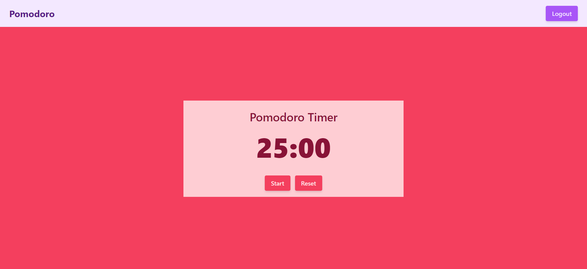
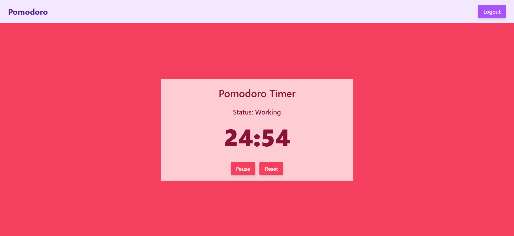
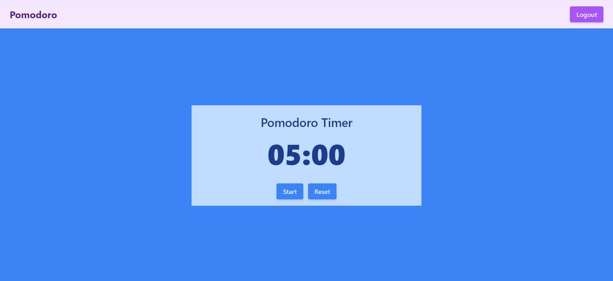
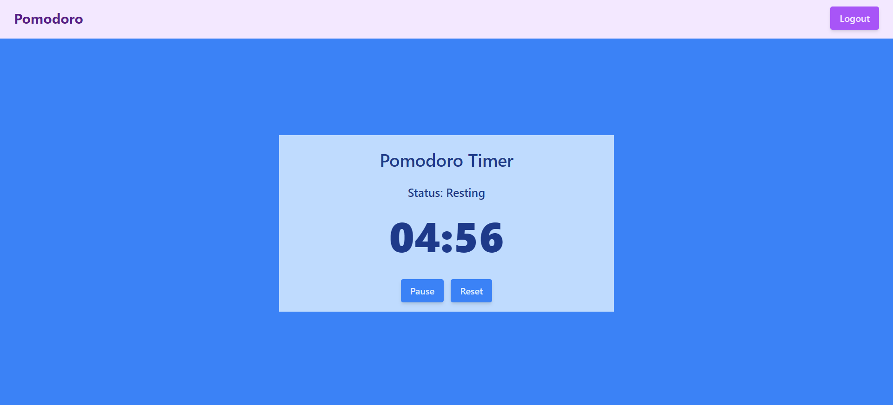

# About Project

It is a simple Pomodro timer app. Users will login using Google (Firebase Auth). After logging, It will show 25 minutes of timer, where the user can reset, pause, and start the timer. It will show a 5-minute break timer when the 25-minute timer is complete.

- Tech Stack: React, Tailwind CSS, Firebase
- Live: [https://heroic-kheer-d4ce94.netlify.app](https://heroic-kheer-d4ce94.netlify.app/)

## ENV Sample

```bash

VITE_API_KEY = Your Firebase api key
VITE_AUTH_DOMAIN = Your Firebase Auth Domain
VITE_PROJECT_ID = Your Firebase Project Id
VITE_BUCKET = Your Firebase Storage Bucket
VITE_SENDERID = Your Firebase Messaging Sender Id
VITE_APPID = Your Firebase App Id

```

## Steps to run

```bash

git clone https://github.com/ajfuturistics/pomodoro-react.git

cd pomodoro-react

npm install

npm run dev

```

## Screenshots









